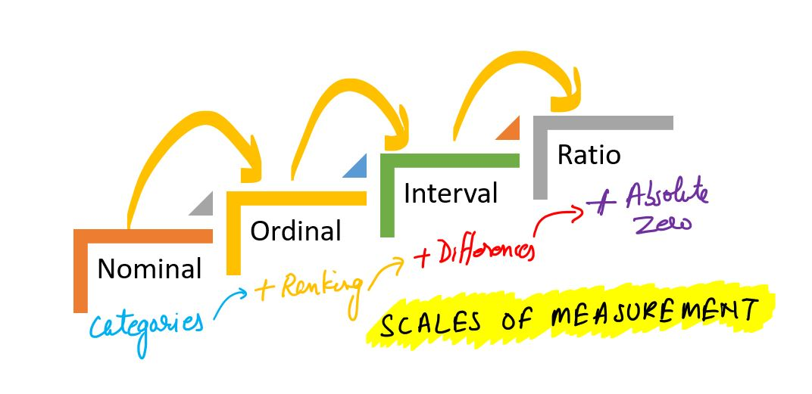
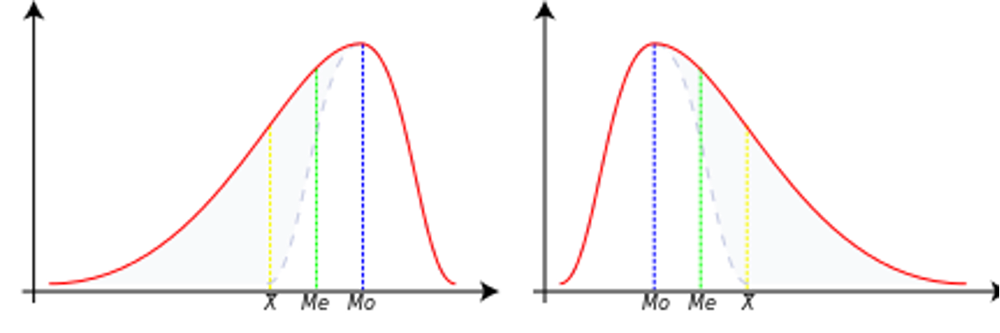
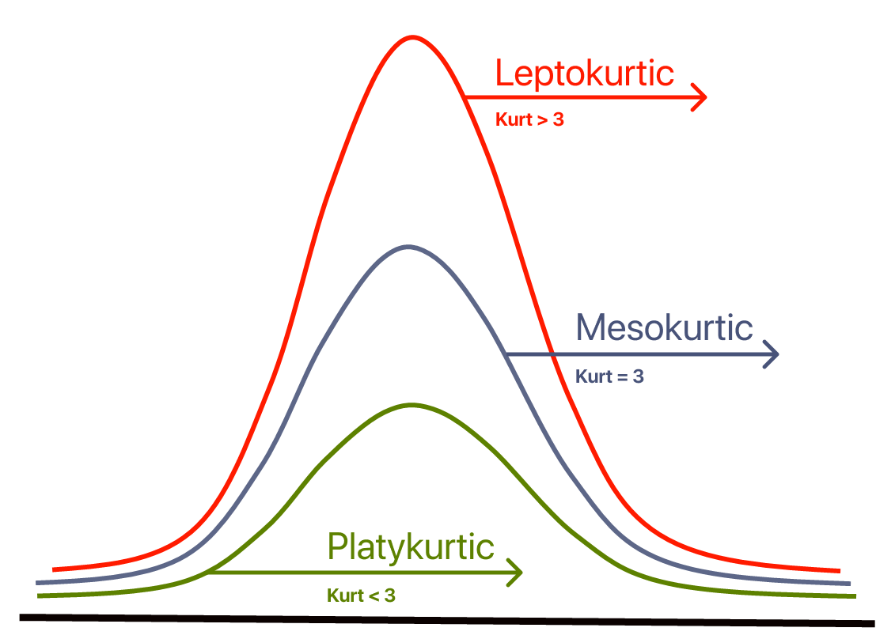

---
jupyter:
  celltoolbar: Slideshow
  kernelspec:
    display_name: Python 3
    language: python
    name: python3
  language_info:
    codemirror_mode:
      name: ipython
      version: 3
    file_extension: .py
    mimetype: text/x-python
    name: python
    nbconvert_exporter: python
    pygments_lexer: ipython3
    version: 3.13.3
  nbformat: 4
  nbformat_minor: 5
---

::: {#6080af38 .cell .markdown slideshow="{\"slide_type\":\"slide\"}"}
# Univariate Analysis
:::

::: {#0d5d00f6 .cell .markdown}
## Looking ahead: April Week 4, May Week 1

-   In the end of April and early May, we\'ll dive deep into
    **statistics** finally.
    -   How do we calculate descriptive statistics in Python?
    -   What principles should we keep in mind?

Univariate analysis is a type of statistical analysis that involves
examining the distribution and characteristics of a single variable. The
prefix "uni-" means "one," so univariate analysis focuses on one
variable at a time, without considering relationships between variables.

Univariate analysis is the foundation of data analysis and is essential
for understanding the basic structure of your data before moving on to
more complex techniques like bivariate or multivariate analysis.
:::

::: {#429df547 .cell .markdown}
# Measurement scales

Measurement scales determine what mathematical and statistical
operations can be performed on data. There are four basic types of
scales:

1.  **Nominal** scale

-   Data is used only for naming or categorizing.
-   The order between values cannot be determined.
-   Possible operations: count, mode, frequency analysis.

Examples:

-   Pokémon type (type_1): "fire", 'water', 'grass', etc.
-   Species, gender, colors.
:::

::: {#3de6b648 .cell .code execution_count="41"}
``` python
import pandas as pd
df_pokemon = pd.read_csv("data/pokemon.csv")
df_pokemon["Type 1"].value_counts()
```

::: {.output .execute_result execution_count="41"}
    Type 1
    Water       112
    Normal       98
    Grass        70
    Bug          69
    Psychic      57
    Fire         52
    Rock         44
    Electric     44
    Ground       32
    Ghost        32
    Dragon       32
    Dark         31
    Poison       28
    Fighting     27
    Steel        27
    Ice          24
    Fairy        17
    Flying        4
    Name: count, dtype: int64
:::
:::

::: {#cff31b52 .cell .markdown}
1.  **Ordinal** scale

-   Data can be ordered, but the distances between them are not known.
-   Possible operations: median, quantiles, rank tests (e.g. Spearman).
:::

::: {#c17b5aee .cell .markdown}
Examples:

-   Strength level: \"low\", \"medium\", \"high\".
-   Quality ratings: \"weak\", \"good\", \"very good\".
:::

::: {#b3dce4ca .cell .code execution_count="42"}
``` python
import seaborn as sns

titanic = sns.load_dataset("titanic")

print(titanic["class"].unique())
```

::: {.output .stream .stdout}
    ['Third', 'First', 'Second']
    Categories (3, object): ['First', 'Second', 'Third']
:::
:::

::: {#1205928a .cell .markdown}
1.  **Interval** scale

-   The data is numerical, with equal intervals, but lacks an absolute
    zero.
-   Differences, mean, and standard deviation can be calculated.
-   Ratios (e.g., \"twice as much\") do not make sense.

Examples:

-   Temperature in °C (but not in Kelvin!). Why? There is no absolute
    zero---zero does not mean the absence of the property; it is just a
    conventional reference point. 0°C does not mean no temperature; 20°C
    is not 2 × 10°C.
-   Year in a calendar (e.g., 1990). Why? Year 0 does not mark the
    beginning of time; 2000 is not 2 × 1000.
-   Time in the hourly system (e.g., 13:00). Why? 0:00 does not mean no
    time, but rather an established reference point.

1.  **Ratio** scale

-   Numerical data with an absolute zero.
-   All mathematical operations, including division, can be performed.

> **Not all numerical data is on a ratio scale!** For example,
> temperature in degrees Celsius is not on a ratio scale because 0°C
> does not mean the absence of temperature. However, temperature in
> Kelvin (K) is, as 0 K represents the absolute absence of thermal
> energy.

Examples:

-   Height, weight, number of Pokémon attack points (attack), HP, speed.
:::

::: {#8bb64fd1 .cell .code execution_count="43"}
``` python
df_pokemon[["HP", "Attack", "Speed"]].describe()
```

::: {.output .execute_result execution_count="43"}
```{=html}
<div>
<style scoped>
    .dataframe tbody tr th:only-of-type {
        vertical-align: middle;
    }

    .dataframe tbody tr th {
        vertical-align: top;
    }

    .dataframe thead th {
        text-align: right;
    }
</style>
<table border="1" class="dataframe">
  <thead>
    <tr style="text-align: right;">
      <th></th>
      <th>HP</th>
      <th>Attack</th>
      <th>Speed</th>
    </tr>
  </thead>
  <tbody>
    <tr>
      <th>count</th>
      <td>800.000000</td>
      <td>800.000000</td>
      <td>800.000000</td>
    </tr>
    <tr>
      <th>mean</th>
      <td>69.258750</td>
      <td>79.001250</td>
      <td>68.277500</td>
    </tr>
    <tr>
      <th>std</th>
      <td>25.534669</td>
      <td>32.457366</td>
      <td>29.060474</td>
    </tr>
    <tr>
      <th>min</th>
      <td>1.000000</td>
      <td>5.000000</td>
      <td>5.000000</td>
    </tr>
    <tr>
      <th>25%</th>
      <td>50.000000</td>
      <td>55.000000</td>
      <td>45.000000</td>
    </tr>
    <tr>
      <th>50%</th>
      <td>65.000000</td>
      <td>75.000000</td>
      <td>65.000000</td>
    </tr>
    <tr>
      <th>75%</th>
      <td>80.000000</td>
      <td>100.000000</td>
      <td>90.000000</td>
    </tr>
    <tr>
      <th>max</th>
      <td>255.000000</td>
      <td>190.000000</td>
      <td>180.000000</td>
    </tr>
  </tbody>
</table>
</div>
```
:::
:::

::: {#de2eba24 .cell .markdown}
### Table: Measurement scales in statistics

  ------------------------------------------------------------------------------------------
  Scale          Example          Is it       Equal      Absolute   Sample statistical
                                  possible to spacing?   zero?      calculations
                                  order?                            
  -------------- ---------------- ----------- ---------- ---------- ------------------------
  **Nominal**    Pokémon type     ❌          ❌         ❌         Mode, counts, frequency
                 (`fire`, `water`                                   analysis
                 etc.)                                              

  **Ordinal**    Ticket class     ✅          ❌         ❌         Median, quantiles
                 (`First`,                                          
                 `Second`,                                          
                 `Third`)                                           

  **Interval**   Temperature in   ✅          ✅         ❌         Mean, standard deviation
                 °C                                                 

  **Ratio**      HP, attack,      ✅          ✅         ✅         All mathematical
                 height                                             operations/statistical
  ------------------------------------------------------------------------------------------
:::

::: {#2aa5d8e9 .cell .markdown}
**Conclusion**: The type of scale affects the choice of statistical
methods - for example, the Pearson correlation test requires quotient or
interval data, while the Chi² test requires nominal data.
:::

::: {#d25856a6 .cell .markdown}

:::

::: {#80997cda .cell .markdown}
### Quiz: measurement scales in statistics. {#quiz-measurement-scales-in-statistics}

Answer the following questions by choosing **one correct answer**. You
will find the solutions at the end.

------------------------------------------------------------------------

#### 1. Which scale **enables ordering of data**, but **does not have equal spacing**? {#1-which-scale-enables-ordering-of-data-but-does-not-have-equal-spacing}

-   A\) Nominal\
-   B\) Orderly\
-   C\) Interval\
-   D\) Ratio

------------------------------------------------------------------------

#### 2. An example of a variable on the **nominal scale** is: {#2-an-example-of-a-variable-on-the-nominal-scale-is}

-   A\) Temperature in °C\
-   B\) Height\
-   C\) Type of Pokémon (`fire`, `grass`, `water`)\
-   D\) Satisfaction level (`low`, `medium`, `high`).

------------------------------------------------------------------------

#### 3. Which scale **does not have absolute zero**, but has **equal spacing**? {#3-which-scale-does-not-have-absolute-zero-but-has-equal-spacing}

-   A\) Ratio\
-   B\) Ordinal\
-   C\) Interval\
-   D\) Nominal

------------------------------------------------------------------------

#### 4. What operations are **allowed** on variables **on an ordinal scale**? {#4-what-operations-are-allowed-on-variables-on-an-ordinal-scale}

-   A\) Mean and standard deviation\
-   B\) Mode and Pearson correlation\
-   C\) Median and rank tests\
-   D\) Quotients and logarithms

------------------------------------------------------------------------

#### 5. The variable `“class”` in the Titanic set (`First`, `Second`, `Third`) is an example: {#5-the-variable-class-in-the-titanic-set-first-second-third-is-an-example}

-   A\) Nominal scale\
-   B\) Ratio scale\
-   C\) Interval scale\
-   D\) Ordinal scale

------------------------------------------------------------------------
:::

::: {#7387c120 .cell .markdown}
# Descriptive statistics

**Descriptive statistics** deals with the description of the
distribution of data in a sample. Descriptive statistics give us basic
summary measures about a set of data. Summary measures include measures
of central tendency (mean, median and mode) and measures of variability
(variance, standard deviation, minimum/maximum values, IQR
(interquartile range), skewness and kurtosis).
:::

::: {#118f7491 .cell .markdown slideshow="{\"slide_type\":\"slide\"}"}
## This week

Now we\'re going to look at **describing** our data - as well as the
**basics of statistics**.

There are many ways to *describe* a distribution.

Here we will discuss:

-   Measures of **central tendency**: what is the typical value in this
    distribution?
-   Measures of **variability**: how much do the values differ from each
    other?\
-   Measures of **skewness**: how strong is the asymmetry of the
    distribution?
-   Measures of **curvature**: what is the intensity of extreme values?
:::

::: {#62f5c475 .cell .code execution_count="44" slideshow="{\"slide_type\":\"-\"}"}
``` python
import numpy as np
import matplotlib.pyplot as plt
import seaborn as sns 
import scipy.stats as stats
```
:::

::: {#4284a34d .cell .code execution_count="45" slideshow="{\"slide_type\":\"-\"}"}
``` python
%matplotlib inline 
%config InlineBackend.figure_format = 'retina'
```
:::

::: {#bd7f172b .cell .markdown slideshow="{\"slide_type\":\"slide\"}"}
## Central tendency

The **central tendency** refers to the "typical value" in a
distribution.

The **central tendency** refers to the central value that describes the
distribution of a variable. It can also be referred to as the center or
location of the distribution. The most common measures of central
tendency are **average**, **median** and **mode**. The most common
measure of central tendency is the **mean**. In the case of skewed
distributions or when there is concern about outliers, the **median**
may be preferred. The median is thus a more reliable measure than the
mean.

There are many ways to *measure* what is "typical" - average:

-   Arithmetic mean
-   Median (middle value)
-   Mode (dominant)
:::

::: {#38ebfe72 .cell .markdown slideshow="{\"slide_type\":\"slide\"}"}
### Why is this useful?

-   A dataset may contain *many* observations.
    -   For example, $N$ = $5000$ of survey responses regarding
        \`height\'.\
-   One way to "describe" this distribution is to **visualize** it.\
-   But it is also helpful to reduce this distribution to a *single
    number*.

This is necessarily a **simplification** of our dataset!
:::

::: {#51fb4bc4 .cell .markdown slideshow="{\"slide_type\":\"slide\"}"}
### *Arithmetic average*

> **Arithmetic average** is defined as the `sum` of all values in a
> distribution, divided by the number of observations in that
> distribution.
:::

::: {#8af89a86 .cell .code execution_count="46" slideshow="{\"slide_type\":\"-\"}"}
``` python
numbers = [1, 2, 3, 4]
### calculating manually...
sum(numbers)/len(numbers)
```

::: {.output .execute_result execution_count="46"}
    2.5
:::
:::

::: {#099ff77c .cell .markdown}
-   The most common measure of central tendency is the average.
-   The mean is also known as the simple average.
-   It is denoted by the Greek letter $µ$ for a population and $\bar{x}$
    for a sample.
-   We can find the average of the number of elements by adding all the
    elements in the data set and then dividing by the number of elements
    in the data set.
-   This is the most popular measure of central tendency, but it has a
    drawback.
-   The average is affected by the presence of outliers.
-   Thus, the average alone is not sufficient for making business
    decisions.

$$
\bar{x} = \frac{1}{n} \sum_{i=1}^{n} x_i
$$
:::

::: {#4cf883d3 .cell .markdown slideshow="{\"slide_type\":\"slide\"}"}
#### `numpy.mean` {#numpymean}

The `numpy` package has a function that calculates an `average` on a
`list` or `numpy.ndarray`.
:::

::: {#9d5aa3bd .cell .code execution_count="47" slideshow="{\"slide_type\":\"-\"}"}
``` python
np.mean(numbers)
```

::: {.output .execute_result execution_count="47"}
    np.float64(2.5)
:::
:::

::: {#0bc40dd0 .cell .markdown}
`scipy.stats.mean`

The [scipy.stats](https://docs.scipy.org/doc/scipy/tutorial/stats.html)
library has a variety of statistical functions.
:::

::: {#0a535063 .cell .code execution_count="48"}
``` python
stats.tmean(numbers)
```

::: {.output .execute_result execution_count="48"}
    np.float64(2.5)
:::
:::

::: {#3aa7d518 .cell .markdown slideshow="{\"slide_type\":\"slide\"}"}
#### Calculating the `average` of a `pandas` column. {#calculating-the-average-of-a-pandas-column}

If we work with `DataFrame`, we can calculate the `average` of specific
columns.
:::

::: {#125f290b .cell .code execution_count="49" slideshow="{\"slide_type\":\"-\"}"}
``` python
import pandas as pd
df_gapminder = pd.read_csv("data/gapminder_full.csv")
df_gapminder.head(2)
```

::: {.output .execute_result execution_count="49"}
```{=html}
<div>
<style scoped>
    .dataframe tbody tr th:only-of-type {
        vertical-align: middle;
    }

    .dataframe tbody tr th {
        vertical-align: top;
    }

    .dataframe thead th {
        text-align: right;
    }
</style>
<table border="1" class="dataframe">
  <thead>
    <tr style="text-align: right;">
      <th></th>
      <th>country</th>
      <th>year</th>
      <th>population</th>
      <th>continent</th>
      <th>life_exp</th>
      <th>gdp_cap</th>
    </tr>
  </thead>
  <tbody>
    <tr>
      <th>0</th>
      <td>Afghanistan</td>
      <td>1952</td>
      <td>8425333</td>
      <td>Asia</td>
      <td>28.801</td>
      <td>779.445314</td>
    </tr>
    <tr>
      <th>1</th>
      <td>Afghanistan</td>
      <td>1957</td>
      <td>9240934</td>
      <td>Asia</td>
      <td>30.332</td>
      <td>820.853030</td>
    </tr>
  </tbody>
</table>
</div>
```
:::
:::

::: {#1c3a00f3 .cell .code execution_count="50" slideshow="{\"slide_type\":\"-\"}"}
``` python
df_gapminder['life_exp'].mean()
```

::: {.output .execute_result execution_count="50"}
    np.float64(59.474439366197174)
:::
:::

::: {#78e65bc5 .cell .markdown slideshow="{\"slide_type\":\"slide\"}"}
#### Your turn

How to calculate the mean life expectancy for EUROPEan countries (2007).
:::

::: {#ca1f2568 .cell .code execution_count="51" slideshow="{\"slide_type\":\"-\"}"}
``` python
## Your code here
mean_life_exp_europe_2007 = df_gapminder[(df_gapminder['continent'] == 'Europe') & (df_gapminder['year'] == 2007)]['life_exp'].mean()
print("Mean life expectancy for European countries (2007):", mean_life_exp_europe_2007)
```

::: {.output .stream .stdout}
    Mean life expectancy for European countries (2007): 77.6486
:::
:::

::: {#d81618ca .cell .markdown slideshow="{\"slide_type\":\"slide\"}"}
#### *Average* and skewness

> **Skewness** means that there are values *extending* one of the
> "tails" of the distribution.

Of the measures of **central tendency**, "average" is the most dependent
on the direction of skewness.

-   How would you describe the following **skewness**?\
-   Do you think the "mean" would be higher or lower than the "median"?
:::

::: {#daceceaa .cell .code execution_count="52" slideshow="{\"slide_type\":\"-\"}"}
``` python
sns.histplot(data = df_gapminder, x = "gdp_cap")
plt.axvline(df_gapminder['gdp_cap'].mean(), linestyle = "dotted");
```

::: {.output .display_data}
{height="433"
width="571"}
:::
:::

::: {#08689326 .cell .markdown slideshow="{\"slide_type\":\"slide\"}"}
#### Your turn {#your-turn}

Is it possible to calculate the average of the column "continent"? Why
or why not?
:::

::: {#2a93284e .cell .code execution_count="53" slideshow="{\"slide_type\":\"-\"}"}
``` python
### Your comment here
## NO because continent is a name not a number
```
:::

::: {#51deaf6b .cell .markdown slideshow="{\"slide_type\":\"slide\"}"}
#### Your turn {#your-turn}

-   Subtract each observation in `numbers` from the `average` of this
    `list`.\
-   Then calculate the **sum** of these deviations from the `average`.

What is their sum?
:::

::: {#c64c81c8 .cell .code execution_count="54" slideshow="{\"slide_type\":\"-\"}"}
``` python
numbers = np.array([1, 2, 3, 4])
### Your code here

# Calculate the average
average = np.mean(numbers)

# Subtract each observation from the average
deviations = numbers - average

# Calculate the sum of deviations
sum_of_deviations = np.sum(deviations)

print("Sum of deviations:", sum_of_deviations)
```

::: {.output .stream .stdout}
    Sum of deviations: 0.0
:::
:::

::: {#542bd4de .cell .markdown slideshow="{\"slide_type\":\"slide\"}"}
#### Summary of the first part

-   The mean is one of the most common measures of central tendency.\
-   It can only be used for **continuous** interval/ratio data.\
-   The **sum of deviations** from the mean is equal to `0`.
-   The "mean" is most affected by **skewness** and **outliers**.
:::

::: {#a4edf9e5 .cell .markdown slideshow="{\"slide_type\":\"slide\"}"}
### *Median*

> *Median* is calculated by sorting all values from smallest to largest
> and then finding the value in the middle.

-   The median is the number that divides a data set into two equal
    halves.
-   To calculate the median, we need to sort our data set of n numbers
    in ascending order.
-   The median of this data set is the number in the position $(n+1)/2$
    if $n$ is odd.
-   If n is even, the median is the average of the $(n/2)$ third number
    and the $(n+2)/2$ third number.
-   The median is robust to outliers.
-   Thus, in the case of skewed distributions or when there is concern
    about outliers, the median may be preferred.
:::

::: {#6f5ec350 .cell .code execution_count="55" slideshow="{\"slide_type\":\"-\"}"}
``` python
df_gapminder['gdp_cap'].median()
```

::: {.output .execute_result execution_count="55"}
    np.float64(3531.8469885)
:::
:::

::: {#afe09cec .cell .markdown slideshow="{\"slide_type\":\"slide\"}"}
#### Comparison of `median` and `average`. {#comparison-of-median-and-average}

The direction of inclination has less effect on the `median`.
:::

::: {#dd75b183 .cell .code execution_count="56" slideshow="{\"slide_type\":\"-\"}"}
``` python
sns.histplot(data = df_gapminder, x = "gdp_cap")
plt.axvline(df_gapminder['gdp_cap'].mean(), linestyle = "dotted", color = "blue")
plt.axvline(df_gapminder['gdp_cap'].median(), linestyle = "dashed", color = "red");
```

::: {.output .display_data}
{height="433"
width="571"}
:::
:::

::: {#db7d9def .cell .markdown slideshow="{\"slide_type\":\"slide\"}"}
#### Your turn {#your-turn}

Is it possible to calculate the median of the column "continent"? Why or
why not?
:::

::: {#189724a5 .cell .code execution_count="57" slideshow="{\"slide_type\":\"-\"}"}
``` python
### Your comment here
## No, because continent is a name and not a number
```
:::

::: {#d7c5e7ca .cell .markdown slideshow="{\"slide_type\":\"slide\"}"}
### *Mode*

> **Mode** is the most common value in a data set.

Unlike `median` or `average`, `mode` can be used with **categorical**
data.
:::

::: {#e139d23f .cell .code execution_count="58" slideshow="{\"slide_type\":\"-\"}"}
``` python
df_pokemon = pd.read_csv("data/pokemon.csv")
df_pokemon['Type 1'].mode()
```

::: {.output .execute_result execution_count="58"}
    0    Water
    Name: Type 1, dtype: object
:::
:::

::: {#862b4479 .cell .markdown slideshow="{\"slide_type\":\"slide\"}"}
#### `mode()` returns multiple values?

-   If multiple values *bind* for the most frequent one, `mode()` will
    return them all.
-   This is because technically, a distribution can have multiple values
    for the most frequent - modal!
:::

::: {#b422f679 .cell .code execution_count="59"}
``` python
df_gapminder['gdp_cap'].mode()
```

::: {.output .execute_result execution_count="59"}
    0          241.165876
    1          277.551859
    2          298.846212
    3          299.850319
    4          312.188423
                ...      
    1699     80894.883260
    1700     95458.111760
    1701    108382.352900
    1702    109347.867000
    1703    113523.132900
    Name: gdp_cap, Length: 1704, dtype: float64
:::
:::

::: {#1d406ca3 .cell .markdown slideshow="{\"slide_type\":\"slide\"}"}
### Measures of central tendency - summary

  -----------------------------------------------------------------------
  Measure        Can be used for:                  Limitations
  -------------- --------------------------------- ----------------------
  Mean           Continuous data                   Influence on skewness
                                                   and outliers

  Median         Continuous data                   Does not include the
                                                   *value* of all data
                                                   points in the
                                                   calculation (ranks
                                                   only)

  Mode           Continuous and categorical data   Considers only
                                                   *frequent*; ignores
                                                   other values
  -----------------------------------------------------------------------
:::

::: {#d480b682 .cell .markdown}
## Quantiles

**Quantiles** are descriptive - positional statistics that divide an
ordered data set into equal parts. The most common quantiles are:

-   **Median** (quantile of order 0.5),
-   **Quartiles** (divide the data into 4 parts),
-   **Deciles** (into 10 parts),
-   **Percentiles** (into 100 parts).

### Definition

A quantile of order $q \in (0,1)$ is a value of $x_q$ such that:

$$
P(X \leq x_q) = q
$$

In other words: $q \cdot 100\%$ of the values in the data set are less
than or equal to $x_q$.

### Formula (for an ordered data set)

For a data sample $x_1, x_2, \ldots, x_n$ ordered in ascending order,
the quantile of order $q$ is determined as:

1.  Calculate the positional index:

$$
i = q \cdot (n + 1)
$$

1.  If $i$ is an integer, then the quantile is $x_i$.

2.  If $i$ is not integer, we interpolate linearly between adjacent
    values:

$$
x_q = x_{\lfloor i \rfloor} + (i - \lfloor i \rfloor) \cdot (x_{\lceil i \rceil} - x_{\lfloor i \rfloor})
$$

**Note:** In practice, different methods are used to determine
quantiles - libraries such as NumPy or Pandas have different modes (e.g.
`method='linear'`, `method='midpoint'`).

### Example - we calculate step by step:

For data: \$ \[3, 7, 8, 5, 12, 14, 21, 13, 18\] \$

1.  We arrange the data in ascending order:

\$ \[3, 5, 7, 8, 12, 13, 14, 18, 21\] \$

1.  Median (quantile of order 0.5):

The number of elements $n = 9$, the middle element is the 5th value:

\$ \\text{Median} = x_5 = 12 \$

1.  First quartile (Q1, quantile of order 0.25):

\$ i = 0.25 \\cdot (9 + 1) = 2.5 \$

Interpolation between $x_2 = 5$ and $x_3 = 7$:

\$ Q_1 = 5 + 0.5 \\cdot (7 - 5) = 6 \$

1.  Third quartile (Q3, quantile of 0.75):

\$ i = 0.75 \\cdot 10 = 7.5 \$

Interpolation between $x_7 = 14$ and $x_8 = 18$:

\$ Q_3 = 14 + 0.5 \\cdot (18 - 14) = 16 \$

### Deciles

**Deciles** divide data into 10 equal parts. For example:

-   **D1** is the 10th percentile (quantile of 0.1),
-   **D5** is the median (0.5),
-   **D9** is the 90th percentile (0.9).

The formula is the same as for overall quantiles, just use the
corresponding $q$. E.g. for D3:

\$ q = \\frac{3}{10} = 0.3 \$

### Percentiles

**Percentiles** divide data into 100 equal parts. E.g.:

-   **P25** = Q1,
-   **P50** = median,
-   **P75** = Q3,
-   **P90** is the value below which 90% of the data is.

With percentiles, we can better understand the distribution of data -
for example, in standardized tests, a score is often given as a
percentile (e.g., "85th percentile" means that someone scored better
than 85% of the population).

------------------------------------------------------------------------

### Quantiles - summary

  ---------------------------------------------------------------------------
  Name         Symbol   Quantile ( q )    Meaning
  ------------ -------- ----------------- -----------------------------------
  Q1           Q1       0.25              25% of data ≤ Q1

  Median       Q2       0.5               50% of data ≤ Median

  Q3           Q3       0.75              75% of data ≤ Q3

  Decile 1     D1       0.1               10% of data ≤ D1

  Decile 9     D9       0.9               90% of data ≤ D9

  Percentile   P95      0.95              95% of data ≤ P95
  95                                      
  ---------------------------------------------------------------------------

------------------------------------------------------------------------
:::

::: {#629fc6ad .cell .markdown}
### Example - calculations of quantiles
:::

::: {#8b8a9b32 .cell .code execution_count="60"}
``` python
# Sample data
mydata = [3, 7, 8, 5, 12, 14, 21, 13, 18]
mydata_sorted = sorted(mydata)
print("Sorted data:", mydata_sorted)
```

::: {.output .stream .stdout}
    Sorted data: [3, 5, 7, 8, 12, 13, 14, 18, 21]
:::
:::

::: {#6521efdd .cell .code execution_count="61"}
``` python
# Conversion to Pandas Series
s = pd.Series(mydata)

# Quantiles
q1 = s.quantile(0.25) # lower quartile Q1
median = s.quantile(0.5) # median or middle quartile Q2 = Me
q3 = s.quantile(0.75) # upper quartile Q3

# Deciles
d1 = s.quantile(0.1) # bottom 10% of data...
d9 = s.quantile(0.9) # top 10% of data...

# Percentiles
p95 = s.quantile(0.95)  # top 5% of data...

print("Quantiles:")
print(f"Q1 (25%): {q1}")
print(f"Median (50%): {median}")
print(f"Q3 (75%): {q3}")
print("\nDeciles:")
print(f"D1 (10%): {d1}")
print(f"D9 (90%): {d9}")
print("\nPercentiles:")
print(f"P95 (95%): {p95}")
```

::: {.output .stream .stdout}
    Quantiles:
    Q1 (25%): 7.0
    Median (50%): 12.0
    Q3 (75%): 14.0

    Deciles:
    D1 (10%): 4.6
    D9 (90%): 18.6

    Percentiles:
    P95 (95%): 19.799999999999997
:::
:::

::: {#9884aaf4 .cell .code execution_count="62"}
``` python
# Create boxplot
fig, ax = plt.subplots(figsize=(8, 6))
sns.boxplot(data=mydata, ax=ax, color='lightblue', width=0.3)

# Calculate statistics
minimum = np.min(mydata)
q1 = np.percentile(mydata, 25)
median = np.median(mydata)
q3 = np.percentile(mydata, 75)
maximum = np.max(mydata)
mean = np.mean(mydata)

ax.scatter(0, minimum, color='red', label='Min', zorder=5)
ax.scatter(0, q1, color='orange', label='Q1 (25th percentile)', zorder=5)
ax.scatter(0, median, color='green', label='Median (50th percentile)', zorder=5)
ax.scatter(0, q3, color='purple', label='Q3 (75th percentile)', zorder=5)
ax.scatter(0, maximum, color='brown', label='Max', zorder=5)
ax.scatter(0, mean, color='black', marker='D', s=60, label='Mean', zorder=5)

for value, name, color in zip(
    [minimum, q1, median, mean, q3, maximum],
    ['Min', 'Q1', 'Median', 'Mean', 'Q3', 'Max'],
    ['red', 'orange', 'green', 'black', 'purple', 'brown']
):
    ax.text(0.1, value, f'{name}: {value:.2f}', verticalalignment='center', color=color)


ax.set_title('Boxplot of mydata with All Measures Marked')
ax.legend(bbox_to_anchor=(1.05, 1), loc='upper left')
plt.show()
```

::: {.output .display_data}
{height="508"
width="940"}
:::
:::

::: {#468dbd28 .cell .code execution_count="63"}
``` python
sns.violinplot(data=mydata, color='lightblue', width=0.3)
plt.show()
```

::: {.output .display_data}
{height="395"
width="546"}
:::
:::

::: {#a790f5b1 .cell .markdown}
### Your turn! {#your-turn}

Looking at the aforementioned quantile results and the box plot, try to
interpret these measures.
:::

::: {#d88e8b29 .cell .markdown}
The quantile results and the box plot provide insights into the
distribution of the data:

1.  **Quantiles**:
    -   **Q1 (25th percentile)**: 25% of the data points are below this
        value. It represents the lower quartile.
    -   **Median (50th percentile)**: The middle value of the dataset,
        dividing it into two equal halves. It is robust to outliers.
    -   **Q3 (75th percentile)**: 75% of the data points are below this
        value. It represents the upper quartile.
    -   **IQR (Interquartile Range)**: The difference between Q3 and Q1,
        representing the range of the middle 50% of the data. It is a
        robust measure of variability.
2.  **Box Plot**:
    -   The box represents the IQR, showing the spread of the middle 50%
        of the data.
    -   The line inside the box indicates the median.
    -   The whiskers extend to the smallest and largest values within
        1.5 times the IQR from Q1 and Q3, respectively.
    -   Points outside the whiskers are potential outliers.

**Interpretation**:

-   If the box is symmetric around the median, the data is evenly
    distributed.
-   A longer whisker or more outliers on one side indicates skewness.
-   The IQR and whisker lengths help identify the spread and variability
    of the data.
:::

::: {#1b6d711b .cell .markdown slideshow="{\"slide_type\":\"slide\"}"}
## Variability

> **Variability** (or **dispersion**) refers to the degree to which
> values in a distribution are *dispersed*, i.e., differ from each
> other.

The **dispersion** is an indicator of how far from the center we can
find data values. The most common measures of dispersion are
**variance**, **standard deviation** and **interquartile range (IQR)**.
The **variance** is a standard measure of dispersion. The **standard
deviation** is the square root of the variance. The **variance** and
**standard deviation** are two useful measures of scatter.
:::

::: {#65ccf2d9 .cell .markdown slideshow="{\"slide_type\":\"slide\"}"}
### The `mean` hides the variance!

Both distributions have *the same* mean, but *different* **standard
deviations**.
:::

::: {#aa87cf4d .cell .code execution_count="64" slideshow="{\"slide_type\":\"-\"}"}
``` python
### Let's create some distributions
d1 = np.random.normal(loc = 0, scale = 1, size = 1000)
d2 = np.random.normal(loc = 0, scale = 5, size = 1000)
### Plots
fig, axes = plt.subplots(1, 2, sharex=True, sharey=True);
p1 = axes[0].hist(d1, alpha = .5)
p2 = axes[1].hist(d2, alpha = .5)
axes[0].set_title("Lower variance");
axes[1].set_title("Higher variance");
```

::: {.output .display_data}
{height="434"
width="552"}
:::
:::

::: {#0d3a1076 .cell .markdown slideshow="{\"slide_type\":\"slide\"}"}
### Volatility detection

There are at least *three* main approaches to quantifying variability:

-   **Range**: the difference between the "maximum" and "minimum" value.
-   **Interquartile range (IQR)**: The range of the middle 50% of the
    data.\
-   **Variance** and **Standard Deviation**: the typical value by which
    results deviate from the mean.
:::

::: {#079082a0 .cell .markdown slideshow="{\"slide_type\":\"slide\"}"}
### Range

> **Range** Is the difference between the `maximum` and `minimum`
> values.

Intuitive, but only considers two values in the entire distribution.
:::

::: {#d3501a1d .cell .code execution_count="65"}
``` python
d1.max() - d1.min()
```

::: {.output .execute_result execution_count="65"}
    np.float64(7.122906507132887)
:::
:::

::: {#ceeaba65 .cell .code execution_count="66"}
``` python
d2.max() - d2.min()
```

::: {.output .execute_result execution_count="66"}
    np.float64(31.25890303127592)
:::
:::

::: {#293cfcb7 .cell .markdown slideshow="{\"slide_type\":\"slide\"}"}
### IQR

> The **interquartile range (IQR)** is the difference between a value in
> the 75% percentile and a value in the 25% percentile.

It focuses on the **center 50%**, but still only considers two values.

-   IQR is calculated using the limits of the data between the 1st and
    3rd quartiles.
-   The interquartile range (IQR) can be calculated as follows:
    $IQR = Q3 - Q1$
-   In the same way that the median is more robust than the mean, the
    IQR is a more robust measure of scatter than the variance and
    standard deviation and should therefore be preferred for small or
    asymmetric distributions.
-   It is a robust measure of scatter.
:::

::: {#84f6740f .cell .code execution_count="67"}
``` python
## Let's calculate quantiles - quartiles Q1 and Q3
q3, q1 = np.percentile(d1, [75 ,25])
q3 - q1
```

::: {.output .execute_result execution_count="67"}
    np.float64(1.295577893411131)
:::
:::

::: {#395472da .cell .code execution_count="68"}
``` python
## Let's calculate quantiles - quartiles Q1 and Q3
q3, q1 = np.percentile(d2, [75 ,25])
q3 - q1
```

::: {.output .execute_result execution_count="68"}
    np.float64(7.196258712529197)
:::
:::

::: {#0eca5265 .cell .markdown slideshow="{\"slide_type\":\"slide\"}"}
### Variance and standard deviation. {#variance-and-standard-deviation}

The **Variance** measures the dispersion of a set of data points around
their mean value. It is the average of the squares of the individual
deviations. The variance gives the results in original units squared.

$$
s^2 = \frac{1}{n - 1} \sum_{i=1}^{n} (x_i - \bar{x})^2
$$

**Standard deviation (SD)** measures the *typical value* by which the
results in the distribution deviate from the mean.

$$
s = \sqrt{s^2} = \sqrt{\frac{1}{n - 1} \sum_{i=1}^{n} (x_i - \bar{x})^2}
$$

where: - $n$ - the number of elements in the sample - $bar{x}$ - the
arithmetic mean of the sample

What to keep in mind:

-   SD is the *square root* of
    [variance](https://en.wikipedia.org/wiki/Variance).\
-   There are actually *two* measures of SD:
-   SD of a population: when you measure the entire population of
    interest (very rare).
    -   SD of a sample: when you measure a *sample* (typical case);
        we\'ll focus on that.
:::

::: {#629f4e6f .cell .markdown slideshow="{\"slide_type\":\"slide\"}"}
#### SD, explained

-   First, calculate the total *square deviation*.
    -   What is the total square deviation from the "mean"?
-   Then divide by `n - 1`: normalize to the number of observations.
    -   What is the *average* squared deviation from the \`average\'?
-   Finally, take the *square root*:
    -   What is the *average* deviation from the "mean"?

The **standard deviation** represents the *typical* or "average"
deviation from the "mean".
:::

::: {#56890445 .cell .markdown slideshow="{\"slide_type\":\"slide\"}"}
#### SD calculation in `pandas`
:::

::: {#5cfdc0c2 .cell .code execution_count="69"}
``` python
df_pokemon['Attack'].std()
```

::: {.output .execute_result execution_count="69"}
    np.float64(32.45736586949845)
:::
:::

::: {#29cb4502 .cell .code execution_count="70"}
``` python
df_pokemon['HP'].std()
```

::: {.output .execute_result execution_count="70"}
    np.float64(25.53466903233207)
:::
:::

::: {#0e8a5d22 .cell .markdown slideshow="{\"slide_type\":\"slide\"}"}
#### Note on `numpy.std`!!! {#note-on-numpystd}

-   By default, `numpy.std` calculates the **population standard
    deviation**!\
-   You need to modify the `ddof` parameter to calculate the **sample
    standard deviation**.

This is a very common error.
:::

::: {#b7380458 .cell .code execution_count="71"}
``` python
### SD in population
d1.std()
```

::: {.output .execute_result execution_count="71"}
    np.float64(0.9979688385211982)
:::
:::

::: {#a55e6978 .cell .code execution_count="72"}
``` python
### SD for sample
d1.std(ddof = 1)
```

::: {.output .execute_result execution_count="72"}
    np.float64(0.9984681974909116)
:::
:::

::: {#4be27c0b .cell .markdown}
### Coefficient of variation (CV). {#coefficient-of-variation-cv}

-   The coefficient of variation (CV) is equal to the standard deviation
    divided by the mean.
-   It is also known as "relative standard deviation."

$$
CV = \frac{s}{\bar{x}} \cdot 100%
$$
:::

::: {#a80cd586 .cell .code execution_count="73"}
``` python
X = [2, 4, 4, 4, 5, 5, 7, 9]
mean = np.mean(X)

# Variance and standard deviation from scipy (for the sample!):
var_sample = stats.tvar(X)      # sample variance
std_sample = stats.tstd(X)      # sample sd

# CV (for sample):
cv_sample = (std_sample / mean) * 100

print(f"Mean: {mean}")
print(f"Sample variance (scipy): {var_sample}")
print(f"Sample sd (scipy): {std_sample}")
print(f"CV (scipy): {cv_sample:.2f}%")
```

::: {.output .stream .stdout}
    Mean: 5.0
    Sample variance (scipy): 4.571428571428571
    Sample sd (scipy): 2.138089935299395
    CV (scipy): 42.76%
:::
:::

::: {#ff01b4fa .cell .markdown}
# Your turn! {#your-turn}

Calculate STD and CV for the SPEED of LEGENDARY and NOT LEGENDARY
pokemons.
:::

::: {#21b698d7 .cell .code execution_count="75"}
``` python
# Your code here
legendary = df_pokemon[df_pokemon['Legendary'] == True]
leg_speed = legendary['Speed']
leg_mean = np.mean(leg_speed)
var_legendary = stats.tvar(leg_speed)
std_legendary = stats.tstd(leg_speed)
cv_legendary = (std_legendary / leg_mean) * 100
print(f"Legendary Pokémons - Speed STD: {std_legendary:.2f}, CV: {cv_legendary:.2f}%")

not_legendary = df_pokemon[df_pokemon['Legendary'] == False]
not_leg_speed = not_legendary['Speed']
not_leg_mean = np.mean(not_leg_speed)
not_leg_std = stats.tstd(not_leg_speed)
not_leg_cv = (not_leg_std / not_leg_mean) * 100
print(f"Not Legendary Pokémons - Speed STD: {not_leg_std:.2f}, CV: {not_leg_cv:.2f}%")
```

::: {.output .stream .stdout}
    Legendary Pokémons - Speed STD: 22.95, CV: 22.91%
    Not Legendary Pokémons - Speed STD: 27.84, CV: 42.54%
:::
:::

::: {#77f4ccf5 .cell .markdown}
## Measures of the shape of the distribution

Now we will look at measures of the shape of the distribution. There are
two statistical measures that can tell us about the shape of a
distribution. These are **skewness** and **curvature**. These measures
can be used to tell us about the shape of the distribution of a data
set.
:::

::: {#36254c61 .cell .markdown}
## Skewness

-   **Skewness** is a measure of the symmetry of a distribution, or more
    precisely, the lack of symmetry.
-   It is used to determine the lack of symmetry with respect to the
    mean of a data set.
-   It is a characteristic of deviation from the mean.
-   It is used to indicate the shape of a data distribution.
:::

::: {#45cef464 .cell .markdown}
Skewness is a measure of the asymmetry of the distribution of data
relative to the mean. It tells us whether the data are more 'stretched'
to one side.

Interpretation:

-   Skewness \> 0 - right-tailed (positive): long tail on the right
    (larger values are more dispersed)
-   Skewness \< 0 - left (negative): long tail on the left (smaller
    values are more dispersed)
-   Skewness ≈ 0 - symmetric distribution (e.g. normal distribution)

Formula (for the sample):

$$
A = \frac{n}{(n-1)(n-2)} \sum_{i=1}^{n} \left( \frac{x_i - \bar{x}}{s} \right)^3
$$

where:

-   $n$ - number of observations
-   $\bar{x}$ - sample mean
-   $s$ - standard deviation of the sample
:::

::: {#88cae2b7 .cell .markdown}

:::

::: {#0d2806da .cell .markdown}
#### Negative skewness

-   In this case, the data are skewed or shifted to the left.
-   By skewed to the left, we mean that the left tail is long relative
    to the right tail.
-   The data values may extend further to the left, but are concentrated
    on the right.
-   So we are dealing with a long tail, and the distortion is caused by
    very small values that pull the mean down and it is smaller than the
    median.
-   In this case we have **Mean \< Median \< Mode**.

#### Zero skewness

-   This means that the dataset is symmetric.
-   A dataset is symmetric if it looks the same to the left and right of
    the midpoint.
-   A dataset is bell-shaped or symmetric.
-   A perfectly symmetrical dataset will have a skewness of zero.
-   So a normal distribution that is perfectly symmetric has a skewness
    of 0.
-   In this case we have **Mean = Median = Mode**.

#### Positive skewness

-   The dataset is skewed or shifted to the right.
-   By skewed to the right we mean that the right tail is long relative
    to the left tail.
-   The data values are concentrated on the right side.
-   There is a long tail on the right side, which is caused by very
    large values that pull the mean upwards and it is larger than the
    median.
-   So we have **Mean \> Median \> Mode**.
:::

::: {#7576e53c .cell .code}
``` python
from scipy.stats import skew
X = [2, 4, 4, 4, 5, 5, 7, 9]
skewness = skew(X)
print(f"Skewness of X: {skewness:.4f}")
```

::: {.output .stream .stdout}
    Skewness of X: 0.6562
:::
:::

::: {#6ffb4526 .cell .markdown}
### Your turn {#your-turn}

Try to interpret the above-mentioned result and calculate example slant
ratios for several groups of Pokémon.
:::

::: {#8604abac .cell .code}
``` python
# Ensure the dataset is loaded
import pandas as pd
from scipy.stats import skew

df_pokemon = pd.read_csv("data/pokemon.csv")

# Calculate skewness for several groups of Pokémon based on 'Type 1'
grouped_skewness = df_pokemon.groupby('Type 1').apply(lambda group: skew(group['Attack'], nan_policy='omit'))

# Display the skewness for each group
print(grouped_skewness)
```

::: {.output .stream .stdout}
    Type 1
    Bug         0.797914
    Dark        0.538188
    Dragon      0.189216
    Electric    0.600140
    Fairy       0.959808
    Fighting   -0.403065
    Fire        0.340286
    Flying     -0.432799
    Ghost       0.871959
    Grass       0.159399
    Ground      0.571162
    Ice         0.593358
    Normal      0.362852
    Poison     -0.005004
    Psychic     1.128261
    Rock        0.247232
    Steel       0.053388
    Water       0.439261
    dtype: float64
:::

::: {.output .stream .stderr}
    C:\Users\Pasjans\AppData\Local\Temp\ipykernel_14564\61097182.py:8: DeprecationWarning: DataFrameGroupBy.apply operated on the grouping columns. This behavior is deprecated, and in a future version of pandas the grouping columns will be excluded from the operation. Either pass `include_groups=False` to exclude the groupings or explicitly select the grouping columns after groupby to silence this warning.
      grouped_skewness = df_pokemon.groupby('Type 1').apply(lambda group: skew(group['Attack'], nan_policy='omit'))
:::
:::

::: {#3a3e7f68 .cell .markdown}
### Interquartile Skewness

**IQR skewness** is a robust, non-parametric measure of skewness that
uses the positions of the quartiles rather than the mean and standard
deviation. It is particularly useful for detecting asymmetry in data
distributions, especially when outliers are present.

The formula for IQR Skewness is:

$$
IQR\ Skewness = \frac{(Q3 - Median) - (Median - Q1)}{Q3 - Q1}
$$ This method is **less sensitive to outliers** and more **robust**
than moment-based skewness, making it ideal for exploratory data
analysis.
:::

::: {#ab5b81d7 .cell .markdown}
### Your turn {#your-turn}

Try to calculate the IQR Skewness coefficient for the sample data:
:::

::: {#d551616a .cell .code execution_count="76"}
``` python
mydata = [3, 7, 8, 5, 12, 14, 21, 13, 18]
# Your code here
def calculate_iqr_skewness(data):
    q1 = np.percentile(data, 25)
    median = np.median(data)
    q3 = np.percentile(data, 75)
    numerator = (q3 - median) - (median - q1) 
    denominator = q3 - q1
    return numerator / denominator

result = calculate_iqr_skewness(mydata);
print(result)
```

::: {.output .stream .stdout}
    -0.42857142857142855
:::
:::

::: {#f5dafa12 .cell .markdown}
## Kurtosis

Contrary to what some textbooks claim, kurtosis does not measure the
'flattening', the 'peaking' of a distribution.

> **Kurtosis** depends on the intensity of the extremes, so it measures
> what happens in the 'tails' of the distribution, the shape of the
> 'top' is irrelevant!

**Excess kurtosis** is just kurtosis minus 3. It's used to compare a
distribution to the normal distribution (which has kurtosis = 3).

Sample kurtosis:

$$
\text{Kurtosis} = \frac{1}{n} \sum_{i=1}^{n} \left( \frac{x_i - \bar{x}}{s} \right)^4
$$

$$
\text{Normalized kurtozis} = \text{Kurtozis} - 3
$$

#### Reference range for kurtosis

-   The reference standard is the normal distribution, which has a
    kurtosis of 3.
-   Often **Excess** is presented instead of kurtosis, where **excess**
    is simply **Kurtosis - 3**.

#### Mesocurve

-   A normal distribution has a kurtosis of exactly 3 (**Excess**
    exactly 0).
-   Any distribution with kurtosis $≈3$ (exces ≈ 0) is called
    **mezocurtic**.

#### Platykurtic curve

-   A distribution with kurtosis $<3$ (**Excess** \< 0) is called
    **platykurtic**.
-   Compared to a normal distribution, its central peak is lower and
    wider and its tails are shorter and thinner.

#### Leptokurtic curve

-   A distribution with kurtosis $>3$ (**Excess** \> 0) is called
    **leptocurtic**.
-   Compared to a normal distribution, its central peak is higher and
    sharper and its tails are longer and thicker.
:::

::: {#57edd444 .cell .markdown}

:::

::: {#337e78fc .cell .markdown}
So:

-   Excess Kurtosis ≈ 0 → Normal distribution
-   Excess Kurtosis \> 0 → Leptokurtic (heavy tails)
-   Excess Kurtosis \< 0 → Platykurtic (light tails)
:::

::: {#0ea34ddd .cell .code}
``` python
from scipy.stats import kurtosis
import numpy as np

data = np.array([2, 8, 0, 4, 1, 9, 9, 0])

# By default, it returns excess kurtosis
excess_kurt = kurtosis(data)
print("Excess Kurtosis:", excess_kurt)

# To get regular kurtosis (not excess), set fisher=False
regular_kurt = kurtosis(data, fisher=False)
print("Regular Kurtosis:", regular_kurt)
```

::: {.output .stream .stdout}
    Excess Kurtosis: -1.6660010752838508
    Regular Kurtosis: 1.3339989247161492
:::
:::

::: {#9f1e6371 .cell .markdown}
### Your turn {#your-turn}

Try to calculate the IQR Kurtosis coefficient for the sample data:
:::

::: {#61ba681b .cell .code execution_count="78"}
``` python
mydata = [3, 7, 8, 5, 12, 14, 21, 13, 18]
# Your code here
a = pd.Series(mydata)

def iqr_kurtosis(a):
    Q1 = a.quantile(0.25)
    Q2 = a.median()
    Q3 = a.quantile(0.75)
    x= Q3-Q2
    y= Q2-Q1
    z= Q3-Q1
    b= (x+y)/z
    return b

iqr_kurt = iqr_kurtosis(a)
print("IQR Kurtosis:", iqr_kurt)
```

::: {.output .stream .stdout}
    IQR Kurtosis: 1.0
:::
:::

::: {#9087642f .cell .markdown}
## Summary statistics

A great tool for creating elegant summaries of descriptive statistics in
Markdown format (ideal for Jupyter Notebooks) is pandas, especially in
combination with the .describe() function and tabulate.

Example with pandas + tabulate (a nice table in Markdown):
:::

::: {#6888047f .cell .code}
``` python
from scipy.stats import skew, kurtosis
from tabulate import tabulate

def markdown_summary(df, round_decimals=3):
    summary = df.describe().T  # transpose so that the variables are in rows
    # Add skewness and kurtosis
    summary['Skewness'] = df.skew()
    summary['Kurtozis'] = df.kurt()
    # Rounding up the results
    summary = summary.round(round_decimals)
    # Nice summary table!
    return tabulate(summary, headers='keys', tablefmt='github')
```
:::

::: {#01600c27 .cell .code}
``` python
# We select only the numerical columns for analysis:
quantitative = df_pokemon.select_dtypes(include='number')

# We use our function:
print(markdown_summary(quantitative))
```

::: {.output .stream .stdout}
    |            |   count |    mean |     std |   min |    25% |   50% |    75% |   max |   Skewness |   Kurtozis |
    |------------|---------|---------|---------|-------|--------|-------|--------|-------|------------|------------|
    | #          |     800 | 362.814 | 208.344 |     1 | 184.75 | 364.5 | 539.25 |   721 |     -0.001 |     -1.166 |
    | Total      |     800 | 435.102 | 119.963 |   180 | 330    | 450   | 515    |   780 |      0.153 |     -0.507 |
    | HP         |     800 |  69.259 |  25.535 |     1 |  50    |  65   |  80    |   255 |      1.568 |      7.232 |
    | Attack     |     800 |  79.001 |  32.457 |     5 |  55    |  75   | 100    |   190 |      0.552 |      0.17  |
    | Defense    |     800 |  73.842 |  31.184 |     5 |  50    |  70   |  90    |   230 |      1.156 |      2.726 |
    | Sp. Atk    |     800 |  72.82  |  32.722 |    10 |  49.75 |  65   |  95    |   194 |      0.745 |      0.298 |
    | Sp. Def    |     800 |  71.902 |  27.829 |    20 |  50    |  70   |  90    |   230 |      0.854 |      1.628 |
    | Speed      |     800 |  68.278 |  29.06  |     5 |  45    |  65   |  90    |   180 |      0.358 |     -0.236 |
    | Generation |     800 |   3.324 |   1.661 |     1 |   2    |   3   |   5    |     6 |      0.014 |     -1.24  |
:::
:::

::: {#fa5b7e75 .cell .markdown}
To make a summary table cross-sectionally (i.e. **by group**), you need
to use the groupby() method on the DataFrame and then, for example,
describe() or your own aggregate function.

Let\'s say you want to group the data by the 'Type 1' column (i.e. e.g.
Pokémon type: Fire, Water, etc.) and then summarise the quantitative
variables (mean, variance, min, max, etc.).
:::

::: {#c1396468 .cell .code}
``` python
# Grouping by ‘Type 1’ column and statistical summary of numeric columns:
group_summary = df_pokemon.groupby('Type 1')[quantitative.columns].describe()
print(group_summary)
```

::: {.output .stream .stdout}
                  #                                                               \
              count        mean         std    min     25%    50%     75%    max   
    Type 1                                                                         
    Bug        69.0  334.492754  210.445160   10.0  168.00  291.0  543.00  666.0   
    Dark       31.0  461.354839  176.022072  197.0  282.00  509.0  627.00  717.0   
    Dragon     32.0  474.375000  170.190169  147.0  373.00  443.5  643.25  718.0   
    Electric   44.0  363.500000  202.731063   25.0  179.75  403.5  489.75  702.0   
    Fairy      17.0  449.529412  271.983942   35.0  176.00  669.0  683.00  716.0   
    Fighting   27.0  363.851852  218.565200   56.0  171.50  308.0  536.00  701.0   
    Fire       52.0  327.403846  226.262840    4.0  143.50  289.5  513.25  721.0   
    Flying      4.0  677.750000   42.437209  641.0  641.00  677.5  714.25  715.0   
    Ghost      32.0  486.500000  209.189218   92.0  354.75  487.0  709.25  711.0   
    Grass      70.0  344.871429  200.264385    1.0  187.25  372.0  496.75  673.0   
    Ground     32.0  356.281250  204.899855   27.0  183.25  363.5  535.25  645.0   
    Ice        24.0  423.541667  175.465834  124.0  330.25  371.5  583.25  713.0   
    Normal     98.0  319.173469  193.854820   16.0  161.25  296.5  483.00  676.0   
    Poison     28.0  251.785714  228.801767   23.0   33.75  139.5  451.25  691.0   
    Psychic    57.0  380.807018  194.600455   63.0  201.00  386.0  528.00  720.0   
    Rock       44.0  392.727273  213.746140   74.0  230.75  362.5  566.25  719.0   
    Steel      27.0  442.851852  164.847180  208.0  305.50  379.0  600.50  707.0   
    Water     112.0  303.089286  188.440807    7.0  130.00  275.0  456.25  693.0   

              Total              ...   Speed        Generation            \
              count        mean  ...     75%    max      count      mean   
    Type 1                       ...                                       
    Bug        69.0  378.927536  ...   85.00  160.0       69.0  3.217391   
    Dark       31.0  445.741935  ...   98.50  125.0       31.0  4.032258   
    Dragon     32.0  550.531250  ...   97.75  120.0       32.0  3.875000   
    Electric   44.0  443.409091  ...  101.50  140.0       44.0  3.272727   
    Fairy      17.0  413.176471  ...   60.00   99.0       17.0  4.117647   
    Fighting   27.0  416.444444  ...   86.00  118.0       27.0  3.370370   
    Fire       52.0  458.076923  ...   96.25  126.0       52.0  3.211538   
    Flying      4.0  485.000000  ...  121.50  123.0        4.0  5.500000   
    Ghost      32.0  439.562500  ...   84.25  130.0       32.0  4.187500   
    Grass      70.0  421.142857  ...   80.00  145.0       70.0  3.357143   
    Ground     32.0  437.500000  ...   90.00  120.0       32.0  3.156250   
    Ice        24.0  433.458333  ...   80.00  110.0       24.0  3.541667   
    Normal     98.0  401.683673  ...   90.75  135.0       98.0  3.051020   
    Poison     28.0  399.142857  ...   77.00  130.0       28.0  2.535714   
    Psychic    57.0  475.947368  ...  104.00  180.0       57.0  3.385965   
    Rock       44.0  453.750000  ...   70.00  150.0       44.0  3.454545   
    Steel      27.0  487.703704  ...   70.00  110.0       27.0  3.851852   
    Water     112.0  430.455357  ...   82.00  122.0      112.0  2.857143   

                                                   
                   std  min   25%  50%   75%  max  
    Type 1                                         
    Bug       1.598433  1.0  2.00  3.0  5.00  6.0  
    Dark      1.353609  2.0  3.00  5.0  5.00  6.0  
    Dragon    1.431219  1.0  3.00  4.0  5.00  6.0  
    Electric  1.604697  1.0  2.00  4.0  4.25  6.0  
    Fairy     2.147160  1.0  2.00  6.0  6.00  6.0  
    Fighting  1.800601  1.0  1.50  3.0  5.00  6.0  
    Fire      1.850665  1.0  1.00  3.0  5.00  6.0  
    Flying    0.577350  5.0  5.00  5.5  6.00  6.0  
    Ghost     1.693203  1.0  3.00  4.0  6.00  6.0  
    Grass     1.579173  1.0  2.00  3.5  5.00  6.0  
    Ground    1.588454  1.0  1.75  3.0  5.00  5.0  
    Ice       1.473805  1.0  2.75  3.0  5.00  6.0  
    Normal    1.575407  1.0  2.00  3.0  4.00  6.0  
    Poison    1.752927  1.0  1.00  1.5  4.00  6.0  
    Psychic   1.644845  1.0  2.00  3.0  5.00  6.0  
    Rock      1.848375  1.0  2.00  3.0  5.00  6.0  
    Steel     1.350319  2.0  3.00  3.0  5.00  6.0  
    Water     1.558800  1.0  1.00  3.0  4.00  6.0  

    [18 rows x 72 columns]
:::
:::

::: {#3589a54b .cell .markdown}
### Your turn! {#your-turn}

Add some cross-sectional plots and try to interpret the results.
:::

::: {#941a89f6 .cell .code execution_count="79"}
``` python
# your code here
plt.hist(df_pokemon[df_pokemon['Legendary'] == True]['Attack'], label = 'Legendary');
plt.axvline(df_pokemon[df_pokemon['Legendary'] == True]['Attack'].mean(), linestyle = "dotted", color = "blue")
plt.axvline(df_pokemon[df_pokemon['Legendary'] == True]['Attack'].median(), linestyle = "dashed", color = "red")
plt.axvline(df_pokemon[df_pokemon['Legendary'] == False]['Attack'].mean(), linestyle = "dotted", color = "green")
plt.axvline(df_pokemon[df_pokemon['Legendary'] == False]['Attack'].median(), linestyle = "dashed", color = "yellow")
plt.hist(df_pokemon[df_pokemon['Legendary'] == False]['Attack'], alpha = 0.5, label = 'Non - legendary');
plt.ylabel('number of pokemon')
plt.xlabel('attack')
plt.legend();
```

::: {.output .display_data}
{height="432"
width="571"}
:::
:::

::: {#762b4b50 .cell .markdown}
### Interpretation of Results

1.  **Grouped Skewness**:
    -   The skewness values for each Pokémon type (`Type 1`) indicate
        the asymmetry of the distribution of the `Attack` attribute
        within each group.
    -   Positive skewness (e.g., `Psychic`, `Fairy`, `Ghost`) suggests
        that the distribution has a longer tail on the right, meaning
        there are a few Pokémon with significantly higher `Attack`
        values.
    -   Negative skewness (e.g., `Fighting`, `Flying`) indicates a
        longer tail on the left, meaning there are a few Pokémon with
        significantly lower `Attack` values.
    -   Skewness close to 0 (e.g., `Poison`, `Steel`) suggests a
        relatively symmetric distribution.
2.  **Group Summary**:
    -   The summary statistics for each Pokémon type (`Type 1`) provide
        insights into the central tendency (mean, median) and
        variability (standard deviation, IQR) of various attributes like
        `HP`, `Attack`, `Defense`, etc.
    -   For example:
        -   `Bug` type Pokémon have a relatively low mean `Total` score
            (378.93) compared to `Dragon` type Pokémon (550.53),
            indicating that `Dragon` type Pokémon are generally
            stronger.
        -   The `Attack` attribute for `Rock` type Pokémon has a high
            standard deviation (35.33), suggesting significant
            variability in the `Attack` values within this group.
3.  **Quantitative Data**:
    -   The `quantitative` DataFrame contains numerical attributes for
        all Pokémon, which can be used for further analysis, such as
        identifying correlations or trends across attributes.

### Key Observations:

-   The `Psychic` type has the highest skewness (1.128), indicating a
    strong right-tailed distribution for `Attack`.
-   The `Bug` type has the lowest mean `Total` score, while `Dragon`
    type Pokémon have the highest mean `Total` score.
-   Variability in attributes like `Attack` and `Defense` is higher for
    certain types (e.g., `Rock`, `Dragon`), suggesting diverse
    characteristics within these groups.
:::

::: {#0f85c721 .cell .markdown}
### Quiz answers on measurement scales:

1.  B\
2.  C\
3.  C\
4.  C\
5.  D
:::
